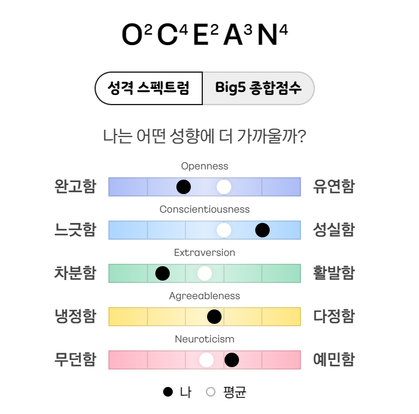
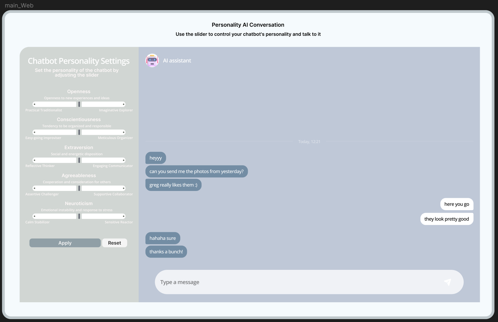

# LLaPo-chat Personality Control System (v1, v2 Draft Log)
> Slider-based personality control (PV merging) + UX validation (A/B)

---
## 0. Context
LLM 성격을 **프롬프트가 아닌 모델 레벨(Personality Vector merging)** 로 미세 조절하고,  
이를 사용자가 직접 조절 가능한 **슬라이더 UX**로 제공했을 때 UX(특히 Enjoyment / User-control)가 실제로 개선되는지 검증한다.

* 슬라이더 UX: 카카오 같이가치 big5 성격검사 참고

  

- 연구 스타일: **HCI/UX 중심 + 모델 제어(merging) 기반 구현**
- 평가 구조: **사용자에게 task 수행 → 설문 + LLM eval(의도대로 움직였는지)**

---
## 1. Goal
사용자가 대화형 AI의 성격(방향/강도/조합)을 **직접 조절**할 수 있게 하고,  
이 조절 경험이 **통제감(User-control)** 및 **즐거움(Enjoyment)** 에 주는 영향을 측정한다.

### Success Criteria (v1)

  

- 사용자는 슬라이더만으로 “성격이 바뀌었다”를 체감한다.  
- 실험 설계에서 A/B 조건이 **동일한 흐름**으로 진행된다(차이는 control 가능 여부만).
- 로그/시간/phase가 안정적으로 기록된다(실험 운영 가능 수준).

---
## 2. Target User (participant persona)
- 일상 대화형 챗봇을 “내 스타일”로 쓰고 싶은 사용자
- 캐릭터/톤을 바꾸며 대화하는 것을 즐기는 사용자
- 상담/동반자형 사용에서 “대화 몰입”을 중요시하는 사용자

---
## v1
### 2025-08-19
- 연구 방향 메모
  - 연구 스타일을 먼저 확정: UX/HCI 기반, 사회과학 이론 근거 포함 여부 등
  - 성격 미세 조절 가능 → 조절 UI 제공 → 사용자에게 task → 설문 + LLM eval(의도대로 움직였는지)
- 구조 구상
  - User ↔ Streamlit(App) ↔ FastAPI(API)
- 구현 계획
  1) base 모델 + 성격 모델(10개)로부터 delta vector 생성
     - create_delta.py
     - DELTA_OUTPUT_DIR = /home/work/.pv/delta
     - 성격 벡터 Δ = (성격 모델 가중치 - base 가중치)
  2) API에서 Δ에 scaling_coefficient를 곱해 base에 합산하여 merged model 생성
     - api.py
     - /merge: slider 설정 반영
     - /chat: 응답 반환
  3) Streamlit UI 연결
     - app.py: sidebar 슬라이더 + 메인 채팅창

### 2025-08-20
- UI를 먼저 만들고 모델 연결 진행
- 슬라이더 구성 초안(Big Five) + 도움말(기능형 설명 필요성 메모)

### 2025-08-21
- 계수 스케일링 불일치/정규화 고민
  - 논문 근거: 5개 벡터 스케일 절댓값 총합이 2.0 초과 시 성능 저하
  - UI 슬라이더값을 계수로 변환 후 L1 norm이 2.0 넘으면 전체 비율로 축소하는 방식 구상
- 모델 역할 붕괴/이상 출력 리스크 기록
  - system prompt에 assistant role + 규칙 명시 필요

### 2025-08-22
- DaRE 적용 시 CPU 런타임 에러 / GPU OOM 이슈
- lm_head/dropout 적용이 불안정 → 안전성 우선 예외처리 필요

### 2025-08-23
- apply_chat_template 관련 CUDA assert 문제
  - pad_token 미설정 이슈 대응: pad_token = eos_token 강제
  - 임시로 Llama 채팅 포맷 수동 구성도 시도
- 문장 끊김 문제/종료 토큰 처리 등 디코딩 안정화 시도

### 2025-08-25
- 다중 trait에서 강도 약화 문제 명확화
  - 1개만 조절: 예산을 독점해 매우 강하게 체감
  - 5개 모두 조절: 예산을 나눠 각 trait가 약하게 체감
- “성격 예산(budget)” 아이디어로 UX에서 해결 방향 전환
  - 총 포인트를 주고 사용자가 분배하는 방식이 직관적
  - 내부 계수는 point * 0.2로 변환하여 총합이 안전 범위(≤2.0) 유지되게 설계

### 2025-08-26
- tokenizer/vocab/lm_head 크기 mismatch 점검 로그 정리
- 템플릿 기반으로 CUDA 오류는 줄었으나, 여전히 이름 hallucination/특수기호 문제 반복
- 성격별 생성 예시 수집(단일 trait 몰빵 테스트: opn/con/ext/agr/neu high/low)

### 2025-08-27
- 연구 프레이밍 메모
  - HCI study 1,2로 분리 가능하나 model merging을 꼭 써야 하는가 고민
  - 기술(merging) 중심으로 두고 UI 제공 시 UX 효과를 서술하는 흐름 제안
- 멀티턴 구현 계획
  - history를 API로 전달해 system+대화 이력 누적
  - 최대 10턴, FIFO로 오래된 턴 삭제

### 2025-08-29
- 성격 예산 10 포인트가 내부 합계 2.0 초과로 이어지던 문제 발견
  - 예산 5로 낮춰 0.4씩 할당해도 2.0 초과 안 하도록 수정
- assistant 역할 붕괴 대응: system prompt에 행동 규칙 명시 강화
  - helpful assistant, 이름 발명 금지, 충분히 설명, task에 맞는 구조 등

### 2025-09-02
- 최종 방향 메모(기술+UX 연결)
  - 모델 병합(PV): Big Five 강도를 파라미터 수준에서 반영
  - 프롬프트(traits_desc): assistant의 기능적 특성/행동을 규정
  - 사용자에게는 “성격”이 아니라 “대화 기능적 특성”을 조절한다는 멘탈모델 제공 가능
- UI 별명(사용자 친화 라벨) + LLM용 정의(trait_definitions) 분리

### 2025-09-05
- 시나리오/운영 방식 메모
  - 각 대화 토픽 설명 가이드 제공
  - 토픽(시나리오) 6개 범주 고려, 대화당 약 3분 정도
  - notice → adjust → merging → chatting → ended 흐름 강화
  - reset 시: 설문 후 adjust로 복귀, 타이머 처리 이슈 수정 필요

---

## v2 초안
### 2025-09-11
- UI 완성 단계 기록
- 토픽에 맞춰 나오게 하고 파일럿 조건 구성 필요

### 2025-09-24 ~ 2025-09-25
- base 조건도 실험 가능하도록
  - LLaPo-chat(슬라이더 ON) 완료 후 LLaPo-base(슬라이더 OFF) 수행
  - A/B 순서 counterbalance 필요
- 파일럿 이슈
  - 유저 입력이 1~2턴 정도 씹힘(턴 증가 시 악화)
  - 주제가 안정적이지 않아 재미가 낮음
  - waiting time(merge) 안내/통제 필요

### 2025-09-30
- 먼저 말걸기(seed_prompt) 기능 구현
  - [system] → [assistant(첫 질문)] → [user] → [assistant]
- trait별 첫 질문 스타일 차이 관찰(agr/ext/neu/opn/con)

### 2025-10-01
- 실험 phase별 UI 락 정책 정리
  - base: 슬라이더 없음
  - adjust: 슬라이더/Apply/Reset 가능
  - merging: sidebar 전체 비활성
  - chatting: Reset만 활성, 나머지 비활성
  - reset_survey: sidebar 전체 비활성
- reset 후 설문/재적용 시 타이머 reset 문제 수정
- 관련 코드 파일 기록
  - ui_(21).py / phases_(29).py / app_-_2025-10-01T173144.477.py / api_(86).py / config_(10).py / utils_(21).py

### 2025-10-05
- 계수 매핑 0.4 → 0.2 버전 별도 파일 보관
  - ui_(1).py / phases_(1).py / utils.py
- 포인트 10으로 늘리면 4개 이상 조합 욕구가 생길 수 있으나, 실제로는 꽉 채우려는 경향도 예상

### 2025-10-08
- 설문 문항 정리(한/영)
  - Satisfaction 7문항
  - Enjoyment 9문항
- 참가자 피로도/중복감 코멘트 가능성 메모

### 2025-10-10
- Streamlit rerun + st_autorefresh 충돌로 응답 누락 발생
  - rerun 중복 방지 로직 추가
  - autorefresh 조건 강화로 완화

### 파일럿 피드백 기록(요약)
- 힌트 문구만으로 성격 상상이 어려움
- 영어 대화라 성격 차이가 덜 와닿는 참가자 있음
- 성격이 강할수록 극단적/대화 질 저하로 느낄 수 있음
- reset 버튼 설명 부족
- 말 씹힘이 빈번(공지+기술적 완화 필요)
- 설문 문항 수가 많아 피로도가 있음
- 이모티콘/스타일 요소가 성격 파악에 도움

### 실험 운영 링크/리소스 메모
- 실험 FLOW(Notion 링크)
- 일정 및 참가자 관리(Google Sheet)
- 사전 Big Five test 결과 폼
- 사용자별 결과 저장(GDrive 폴더)
- 참가자별 예외 케이스 운영 메모(번호 변경, 세션 중단 등)
